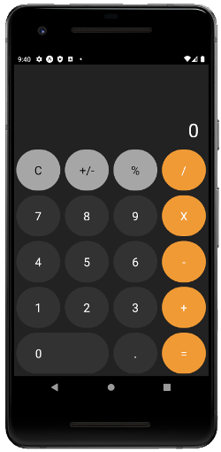
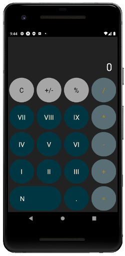
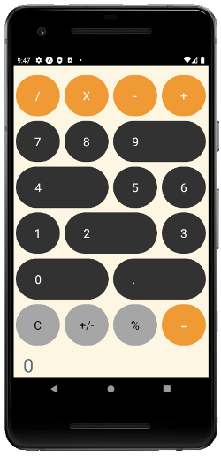

# What is it?

It's a simple React Native application, based on [this calculator](https://github.com/ReactNativeSchool/react-native-calculator), showcasing how a white label app could be implemented with React Native and Babel.

Have a look at [this blog post](https://medium.com/@jaroslaw.marek/white-label-mobile-app-with-react-native-and-babel-490363ec59) for a detailed explanation of how it works.

# Local setup
## EnvKey
This project uses [EnvKey]() for configuration management. YOu need to install `envkey-source` to be able to run it locally:
```
curl -s https://raw.githubusercontent.com/envkey/envkey-source/master/install.sh | bash
```

## Select which product brand you work on
In your .env file, ensure the value of ENVKEY is set and points to the desired brand configuration from EnvKey.
Then run following command to configure the given brand:
```
yarn configure-brand
```

Note: for Mac, it is necessary to have XCode installed and on the path prior to running
`yarn configure-brand`.

# Building

You can build three different versions of this app. One for each "brand": `calc_co`, `acme` and the default.

Obviously, before building it you need to run `yarn install`.

# Running

Ensure you start the Metro bundler manually (with `yarn start`) before running the app in Debug mode.
When Metro is started automatically via react-native scripts, it does not contain the required environmental variables.

`yarn android` or `yarn ios` will produce one of the following apps (depending on which ENVKEY is defined in the `.env` file).







## Switching between the brands

1. Stop the Metro bundler.
1. Change  value of `ENVKEY` in the `.env` file.
1. Run `yarn configure-brand`.
1. Start the Metro bundler with `yarn start --reset-cache` (resetting the bundler cache is important here)
1. Start the app with `yarn android` or `yarn ios`

# More detailed docs
- Usage of the Whitelabelling mechanism: [docs/usage.md](docs/usage.md)
- Intricacies and mechanics of the Whitelabelling mechanism: [docs/mechanics.md](docs/mechanics.md)
- Known issues: [docs/known_issues.md](docs/known_issues.md)
