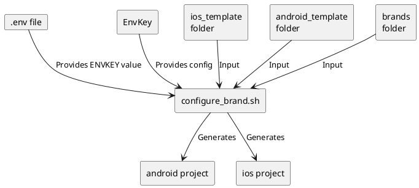
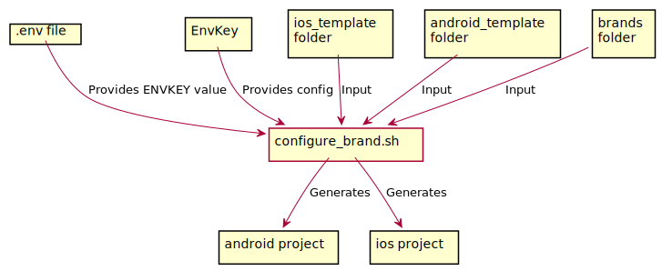

# Intricacies and mechanics of the Whitelabelling mechanism

## Preamble
This document explains how exactly whitelabelling is set-up for the project and what happens behind the scenes.

In case you're looking for the documentation on how to use it in day-to-day development, please refer to [the usage](./usage.md) instead.

## Table of contents
At the high-level, whitelabelling this React Native app can be split into following categories:
1. [Configuration management](#Configuration-management)
1. [Native side](#Native-side) - that covers application icon, name, bundle ID, etc.
1. [JavaScript side](#JavaScript-side) - branded components, styles, etc.

[There are](https://hackernoon.com/setting-up-android-like-product-flavors-in-react-native-39b6c011061b)
[many approaches](https://medium.com/flawless-app-stories/react-native-white-label-101-163c1967c12a)
[described out there](https://medium.com/@dzigorium/one-code-base-for-a-mobile-application-6fe086f24fdd) 
that tackle whitelabelling of the React Native apps, but they all try to apply the same tool 
([flavours/build variants](https://developer.android.com/studio/build/build-variants) for Android 
and [targets](https://developer.apple.com/library/archive/documentation/ToolsLanguages/Conceptual/Xcode_Overview/WorkingwithTargets.html) for iOS) 
to solve all of the above three areas, which I don't think is the right thing to do.

Let's dive into what I propose as the alternative.

NOTE: All of the brand specific stuff (apart from the configuraiton itself) resides in the `App/brands` directory.

## Configuration management
[EnvKey](https://www.envkey.com/) manages app configuration per environment by default.
For the purpose of whitelabelling the concept of [sub-environments](https://docs.envkey.com/overriding-envkey-variables.html) is used.

The sub-environments allow to override only specific config values per product brand and re-use most of the values from the "main" environment configuration.

The "main" configuration represents the `default` brand.


When wanting to refer to the specific sub-environment values on your local machine or CI/CD agent, you need to grab appropriate key from the EnvKey app.
The values of these keys can only be seen once, at the time of generating them so save them somewhere.

By using sub-environments, we make each server key (value of the `ENVKEY` variable) to represent a combination of environment and brand at the same time.

## Native side
At the moment the only "native" things which are able to be whitelabelled are: application icon, fonts, application name and bundle/package ID.
That list could potentially be extended, but there wa sno need so far.

I looked at using [iOS targets](https://medium.com/flawless-app-stories/react-native-white-label-101-163c1967c12a)
and [Android flavours](https://medium.com/@najera.sean/react-native-white-label-102-aba9c56f385c) as means of handling
whitelabelling just the native side of things, but I discared these options due to potentially too big overhead of manually maintaining these in a platform specific manner within two distinct IDEs.

The approach here is based on the concept of project templates. You can see there are `android_template` and `ios_template` directories at the root of the repo, but the actual `android` and `ios` ones are gitignored. This is because the actual project directories are generated from the templates based on the configuration of your choosing (coming from EnvKey, see above).

Once you have the appropriate `ENVKEY` set in your `.env` file, you can run the `yarn configure-brand` command (which will execute the [configure_project.sh](../scripts/configure_project.sh) script) to generate `android` and `ios` projects. The script itself does more than just that, but I'll cover that in the below sections.

The below diagram illustrates how it all comes together:





### Application Icon
Icons (or rather icon sets) must be placed under `App/brands/<brand>/nativeAssets/appIcon/<platform>/`.
See any existing brand for an example. You can use the following tools to generate icons for
[Android](https://romannurik.github.io/AndroidAssetStudio/icons-launcher.html) and [iOS](https://appicon.co/#app-icon).

The icon for the given brand and platform is simply copied across to appropriate destinations under the `android` and `ios`
folders as part of the [configure_brand.sh](../scripts/configure_brand.sh) script. No magic here ;)

NOTE: With the application icons, there's no fallback location maechanism in place. Icons need to exist separately for each brand.

### Fonts
Each brand can define its own fonts which will be linked to both android and ios projects using React Native's built-in auto linking,
but enhanced by using the [react-native-asset](https://www.npmjs.com/package/react-native-asset) library.

The location of the fonts is `App/brands/<brand>/nativeAssets/fonts`.

The magic here was to make React Native to dynamically select the source folder for these fonts depending on the EnvKey configuration.
It was solved by setting the `assetsDir` dynamically in the [configure_brand.sh](../scripts/configure_brand.sh) script.

Note that there's a fallback logic if there's no fonts folder for the given brand, the ones from the `default` brand will be used.

The actual process of linking/unlinking fonts as required is handled by the [configure_project.sh](../scripts/configure_project.sh), specifically  the `npx react-native-asset` command within it. Using the `react-native-asset` is great as it means we don't need to maually unlink fonts which may have previously existed in the generated android and ios projects for different brands. It ensures that only fonts required by the currently selected brand will be linked.

### Application name & bundle ID
The app name and bundle ID are generally pulled from the EnvKey config (via `DISPLAY_NAME` and `BUNDLE_ID` variables respectively), but there are small differences between Android and iOS.

#### Android
Android project references the env vars directly from within its [build.gradle](../android_template/app/build.gradle) file.

Since the Android project references the env vars directly, we need to ensure that they are set in the process that runs the android build.
That's why the `yarn android` command was modified in the `package.json` and the [load_env.sh](../scripts/load_env.sh) is sourced before the actual `react-native run-android` is run.

With the variables being set in `build.gradle` we then refer to them in the `defaultConfig` section. Setting the application ID is straightforward, the rest of them are added to the `manifestPlaceholders` map, which makes it possible to refer to them in the [AndroidManifest.xml](../android_template/app/src/main/AndroidManifest.xml) e.g.:

```
android:label="${DISPLAY_NAME}"
```

#### iOS
With iOS, I didn't find a straightforward way to refer to the env vars directly at built time (mostly because it's so focused on its own way of doing things with XCode), so I went with a bit different approach.

I did look at using the [react-native-config](https://github.com/luggit/react-native-config) to handle providing external configuration into the ios project, but it felt like a too heavy tool for just that one limited use-case. We also looked at just mimicing what react-native-config does around [being able to refer to external config](https://github.com/luggit/react-native-config#ios-1) within XCode, but it turned out that all it does is to copy the config values into XCode specific [xcconfig](https://help.apple.com/xcode/mac/8.3/#/dev745c5c974) file which felt like an unnecessary layer of abstraction in our case.

I ended up using the [PListBuddy](https://medium.com/@marksiu/what-is-plistbuddy-76cb4f0c262d) utility (I couldn't find a link to official docs, thus linking to a post on Medium). It's used to inject some configuration values into ios project at the time of generating it from the template. What it means is that the values seem static to XCode, but they can change whenever you run `yarn configure-brand`.

The [configure_brand.sh](../scripts/configure_brand.sh) script injects application name and ID as follows:

```bash
/usr/libexec/PlistBuddy -c "Set :CFBundleIdentifier $BUNDLE_ID" ios/SkyNativeAppRN/Info.plist
/usr/libexec/PlistBuddy -c "Set :CFBundleDisplayName $DISPLAY_NAME" ios/SkyNativeAppRN/Info.plist
```

The values of `BUNDLE_ID` and `DISPLAY_NAME` variables are pulled from EnvKey at the beginning of the script.

## JavaScript side
Whitelabelling within JS/TS layer is based on the [module-resolver](https://www.npmjs.com/package/babel-plugin-module-resolver) Babel plugin and its ability to control how modules will be looked up at the build time.

Additionally, the above module resolver's ability to provide multiple paths as `root` locations is leveraged to serve branded components from the `default` brand when given component wasn't explicitly overriden for the brand that is being built.

The extract from the [babel.config.js](../babel.config.js) for reference:

```javascript
const paths = require('./scripts/projectPaths');
module.exports = {
  presets: [...],
  plugins: [
    [
      'module-resolver',
      {
        extensions: [...],
        root: [`./App/brands/${process.env.APP_BRAND}`, './App/brands/default'],
      },
    ],
    ...
  ]
}
```

Plese refer to [this blog post](https://levelup.gitconnected.com/white-label-mobile-app-with-react-native-and-babel-490363ec59) to see in details
what that means and how it works in practise.

TL;DR; For anything which is imported with the `import` keyword, it can ensure the resulting module/component that gets bundled comes from a specific brand.
The branded JS/TS code resides in `App/brands/<brand>/*`.

Please refer to [the implementation guidelines](./usage.md#Implementation-guidelines) to see how this mechanism can be applied to many different cases.

Since the whole mechanism depends on having the env vars set in the process that runs the Metro bundler, you need to ensure they are always there with up to date values.
That's why the `yarn start` command was modified in the `package.json` and the [load_env.sh](../scripts/load_env.sh) is sourced before the actual `react-native start` is run.

#### IDE support
With some of the imports being dynamic, there was an additional reuqirement to help IDEs resolve such imports and not seeing "Unable to resolve module" error on all branded components imports.
Luckily, there's a solution to that :)

##### VS Code
It's best to use TypeScript as VS Code has native support for TS and is able to "understand" the `tsconfig.json` file,
by providing appropriate config in that file, you can have VS Code working seamlessly with the dynamic imports.

Only problem with that is that `tsconfig.json` is a static file and a dynamic behaviour was needed, so something like `.js` form of that config that can have the dynamic part added to it which would read the env vars (similarly to `babel.config.js`).

Since TS community didn't added support for a JS/TS version of the config file yet and probably never will
(see `What about tsconfig.js? Nooooooooooooooooooooooooooooo` from [2018 meeting notes](https://github.com/microsoft/TypeScript/issues/27486)),
I ended up using the [tsconfig.js library](https://www.npmjs.com/package/tsconfig.js) to generate the static `tsconfig.json`.

The result is that there is `tsconfig.json` file in the `.gitignore` list (as it's a generated file) and use [tsconfig.js file](../tsconfig.js) as a template. Whenever you run `yarn configure-brand`, it will regenerate the `tsconfig.json` with appropriate path mappings for the given brand  as per the below snippet from `tsconfig.js`:

```
paths: {
    '*': [
        `./App/brands/${process.env.APP_BRAND}/*`,
        './App/brands/default/*',
      ],
},
```

As you can see, the same default fallback mechanism exists here as in the `babel.config.js` so the "logic" of module resolution in VS Code is exactly the same as what Metro bundler will end up doing.

##### WebStorm & IntelliJ IDEA
According to the [Editors autocompletion](https://www.npmjs.com/package/babel-plugin-module-resolver#user-content-editors-autocompletion) section of `babel-plugin-module-resolver` there's a way of making WebStorm and IntelliJ properly resolve branded components by marking them as "resources root", but I haven't tried that one out yet. It seems to have some limitations though and not sure it will work as good as with VS Code.

### EnvKey config in JS
In order to enable using config values from EnvKey in the JS/TS layer, the [transform-inline-environment-variables](https://www.npmjs.com/package/babel-plugin-transform-inline-environment-variables) Babel plugin is used and a list of env vars we'd like it to include is provided as follows
(extract from [babel.config.js](../babel.config.js)):

```javascript
module.exports = {
  presets: [...],
  plugins: [
    [
      'transform-inline-environment-variables',
      {
        include: [
          'SENTRY_DSN',
          'SEGMENT_KEY',
          'BASE_API_URL',
          ...
        ],
      },
    ],
  ],
};
```

Within JS/TS code we can refer to these variables with `process.env.SENTRY_DSN`.

### EnvKey config in native code
TODO
